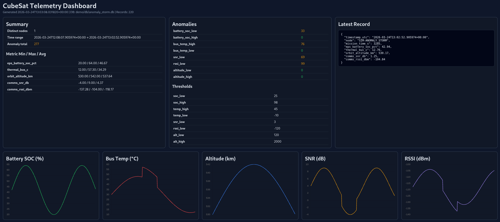

# CubeSat Telemetry Simulator (XIAO ESP32-C3)

This project mocks a **typical LEO CubeSat heartbeat** and emits telemetry every **15 seconds**.



## Quick Start (1-2-3)

1. Open `QUICK_SETUP_GUIDE.md`
2. Pick **Demo mode** (no hardware) or **Live mode** (XIAO ESP32-C3)
3. Run the copy/paste commands to generate dashboards and reports

One-command live run (with connected XIAO ESP32-C3):

```bash
bash run_live_demo.sh
```

## At a glance

- Main firmware: `cubesat_simulator.ino`
- Ground receiver firmware (2nd ESP32 for OTA mode): `ground_station_receiver.ino`
- PC ground logger/decoder: `ground_station_logger.py`
- 1U CubeSat 3D print files: `cubesat_3d_printfiles/` (4 STL parts for a physical mock enclosure)

## Hardware reality check

If you want **over-the-air telemetry** (ESP-NOW/radio-like link), you need both sides:

1. Spacecraft/transmitter node (XIAO ESP32-C3 running `cubesat_simulator.ino`)
2. Ground receiver node (ESP32 running `ground_station_receiver.ino`)

Then your Raspberry Pi/PC reads data from the receiver board over serial.

If you skip the separate receiver board, the host must have a compatible radio interface directly attached and a matching decode path.

## Documentation map

- `TELEMETRY_PIPELINE.md`
- `PIPELINE_FLOWCHART.md` (presentation-ready Mermaid diagram)
- `QUICK_SETUP_GUIDE.md` (fast 1-2-3 workflow for demos and live runs)
- `OPERATOR_CHEAT_SHEET.md` (copy/paste command-only handout)
- `GITHUB_DISCOVERY.md` (short profile blurb + lightweight pinning checklist)
- `SERIAL_CONNECTIONS.md` (USB and USB-UART wiring guide for Pi/PC)

## What this simulates

The telemetry schema is based on common CubeSat bus telemetry categories:

- **Orbit**: altitude, inclination, latitude, longitude, eclipse flag
- **EPS (power)**: battery SOC/voltage/current, solar input power, load power
- **Thermal**: bus, battery, and payload temperatures
- **ADCS**: Euler attitude, gyro rates, magnetometer vector, sun vector
- **Comms health**: link RSSI/SNR and nominal downlink rate
- **General health**: watchdog/fault flags

The values evolve continuously with orbital phase and noise so they look like realistic mission telemetry rather than static random numbers.

## Output/transport behavior

Every 15 seconds:

1. A **full JSON line** is printed to Serial (primary stream).
2. Optional: a **compact heartbeat JSON** is sent over ESP-NOW (infra-free, no router).

Why compact over ESP-NOW:

- ESP-NOW payload size is limited, so full telemetry JSON is too large for one frame.
- Full frame remains on Serial; compact frame gives an over-the-air heartbeat.

## Research summary: how real CubeSat telemetry is transmitted

For actual LEO CubeSats, telemetry is typically downlinked over dedicated RF links (not Wi-Fi):

- **UHF/VHF** links are very common for low-rate telemetry/beacon
- **S-band/X-band** are used for higher-rate missions
- Packet/data link often uses **AX.25**, CSP, or mission-specific framed protocols
- Ground segment usually consists of:
  - Tracking antenna + rotator
  - RF front end (LNA/filter/transceiver)
  - Modem/TNC and decoder software
  - Mission control software/database

For hobby/educational missions, AX.25 packet radio in amateur bands is still common.

## Important limitation of XIAO ESP32-C3 in real space comms

ESP32-C3 has 2.4 GHz Wi-Fi/BLE radio intended for terrestrial short-range use.
For a true space-to-ground link you would normally add a dedicated satellite transceiver subsystem (UHF/S-band etc.), proper antennas, and satisfy licensing/regulatory requirements.

So this project is a **mission telemetry simulator + local link prototype**, not a flight-legal RF stack.

## Flashing and running

## 1) Simulator node (XIAO ESP32-C3)

1. Open `cubesat_simulator.ino` in Arduino IDE / PlatformIO.
2. Select board: **Seeed XIAO ESP32C3**.
3. Upload.
4. Open Serial Monitor at `115200`.
5. Observe one JSON telemetry object every 15 seconds.

### Enable ESP-NOW heartbeat link

In `cubesat_simulator.ino`:

- Set `ENABLE_ESPNOW = true`
- Set `GROUND_STATION_MAC` to the MAC of your receiver board

## 2) Ground station receiver (required for OTA/ESP-NOW mode)

1. Flash `ground_station_receiver.ino` to any ESP32 board.
2. Open Serial Monitor at `115200`.
3. On boot it prints its MAC address.
4. Copy that MAC into `GROUND_STATION_MAC` in simulator firmware.
5. Reflash simulator and watch received heartbeat packets.

If you are using direct USB serial from the simulator board to your host (no OTA link), this receiver step is not required.

## Suggested next step toward “realistic space radio”

If you want this to better resemble real CubeSat downlink architecture:

1. Keep this JSON generation unchanged as the mission telemetry source.
2. Add a radio framing layer (e.g., AX.25-like frame payloads).
3. Feed those frames to a dedicated sub-GHz/UHF transceiver + TNC/modem path.
4. Build a software ground decoder that reassembles frames back into JSON/DB records.

## Ground station logger (PC)

`ground_station_logger.py` reads JSON telemetry from Serial (or stdin), stores it in both CSV and SQLite, and can show live plots.

### Install dependencies

```bash
python3 -m venv .venv
source .venv/bin/activate
pip install -r requirements.txt
```

### Run from simulator Serial

```bash
python3 ground_station_logger.py --port /dev/ttyACM0 --baud 115200 --echo
```

Outputs:

- `data/telemetry.csv`
- `data/telemetry.db`

### Live plotting mode

```bash
python3 ground_station_logger.py --port /dev/ttyACM0 --plot --echo
```

### Log a fixed number of records (test mode)

```bash
python3 ground_station_logger.py --port /dev/ttyACM0 --max-records 10 --echo
```

### Pipe mode (stdin)

Useful if telemetry comes from another process/file:

```bash
cat telemetry_lines.jsonl | python3 ground_station_logger.py --stdin --echo
```

## Telemetry report utility

`telemetry_report.py` analyzes `data/telemetry.db` and generates:

- min/max/avg metrics
- anomaly counts from threshold rules
- latest record summary

### Default text report

```bash
python3 telemetry_report.py
```

### JSON report (machine-readable)

```bash
python3 telemetry_report.py --json
```

### Analyze only recent records

```bash
python3 telemetry_report.py --limit 100
```

### Custom anomaly thresholds

```bash
python3 telemetry_report.py --soc-low 30 --temp-high 40 --snr-low 5
```

## HTML dashboard generator

`telemetry_dashboard.py` generates an offline HTML dashboard from the SQLite data with charts + anomaly table.

### Generate dashboard

```bash
python3 telemetry_dashboard.py
```

Default output:

- `data/dashboard.html`

### Analyze a custom record window

```bash
python3 telemetry_dashboard.py --limit 1000 --out data/dashboard_recent.html
```

### Open dashboard in browser

```bash
xdg-open data/dashboard.html
```

## Live auto-refresh dashboard server

`live_dashboard_server.py` regenerates `dashboard.html` on a timer and serves it locally.

Run this in one terminal:

```bash
python3 live_dashboard_server.py --interval 5 --port 8000
```

Then open:

```bash
xdg-open http://127.0.0.1:8000/dashboard.html
```

Run logger in another terminal (example):

```bash
python3 ground_station_logger.py --port /dev/ttyACM0 --baud 115200 --echo
```

Optional one-shot refresh without serving:

```bash
python3 live_dashboard_server.py --refresh-only
```

## Demo dashboards (pre-generated samples)

Three sample dashboards are generated for product demos:

- `demo/dashboards/index.html` (demo landing page)
- `demo/dashboards/dashboard_sample_1_nominal.html`
- `demo/dashboards/dashboard_sample_2_eclipse_heavy.html`
- `demo/dashboards/dashboard_sample_3_anomaly_storm.html`

They are backed by sample SQLite datasets in `demo/db/`.

Regenerate anytime:

```bash
python3 generate_demo_dashboards.py
```

Open one sample:

```bash
xdg-open demo/dashboards/dashboard_sample_3_anomaly_storm.html
```

Open the demo landing page:

```bash
xdg-open demo/dashboards/index.html
```


